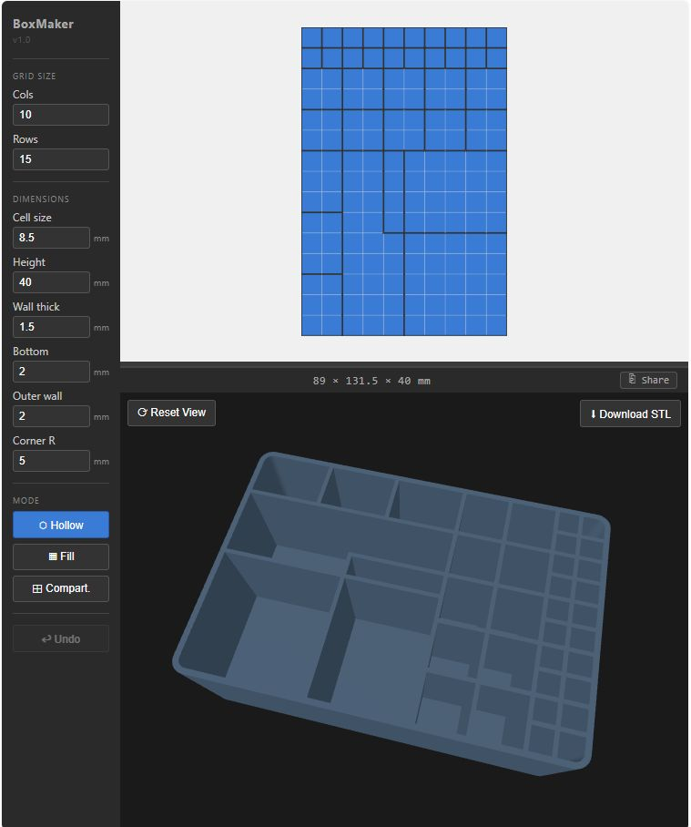

# BoxMaker

A browser-based tool for designing custom organiser boxes — hollow-cell grids with compartments, configurable dimensions, and a live 3D preview. Outputs ready-to-print STL files.



## What it does

Design a rectangular box by drawing a grid of hollow and solid cells. Each cell is a compartment slot; solid cells become filled walls. You can subdivide compartments further with interior dividers. All dimensions are in millimetres and feed directly into the 3D model.

The live 3D preview updates instantly as you design, and you can download the result as an STL file for slicing and printing.

## Usage

### Designing the layout

- **Drag** across the grid to select a rectangular region, then release to apply the current mode.
- **Hollow** — carve out an open compartment in the selected region.
- **Fill** — fill the selected region solid (wall material).
- **Compart.** — add divider walls around the selected region inside an existing hollow area.
- **Undo** — step back through the last change.
- **Mouse wheel** over the grid to zoom in/out (0.25× – 4×).

### Dimensions (sidebar)

| Parameter | Description |
|-----------|-------------|
| Cell size | Width/depth of each grid cell (mm) |
| Height | Total box height (mm) |
| Wall thick | Interior divider wall thickness (mm) |
| Bottom | Floor thickness (mm) |
| Outer wall | Thickness of the outer box walls (mm) |
| Corner R | Outer corner rounding radius (mm); inner corners scale automatically |

### 3D preview

- **Drag** to orbit, **scroll** to zoom, **right-drag** to pan.
- **⟳ Reset View** — return to the default camera angle.
- **⬇ Download STL** — export the current model as a binary STL file.
- Drag the **divider bar** between the grid and the preview to adjust how much vertical space each panel gets.

### Sharing

Click **⎘ Share** in the preview header to copy a URL that encodes the complete current state — layout, all parameters, splitter position, and zoom level. Opening the URL restores the design exactly.

## Running locally

```bash
npm install
npm run dev
```

Then open [http://localhost:5173](http://localhost:5173).

### Building a single-file bundle

```bash
npm run build
```

The output in `dist/` is a single self-contained HTML file (via `vite-plugin-singlefile`) that can be opened directly in any browser without a server.

## Tech stack

- [Svelte 5](https://svelte.dev) — reactive UI
- [Three.js](https://threejs.org) — WebGL 3D preview and STL export
- [@jscad/modeling](https://openjscad.xyz) — CSG solid modelling for the box geometry
- [Vite](https://vitejs.dev) + [vite-plugin-singlefile](https://github.com/richardtallent/vite-plugin-singlefile)
